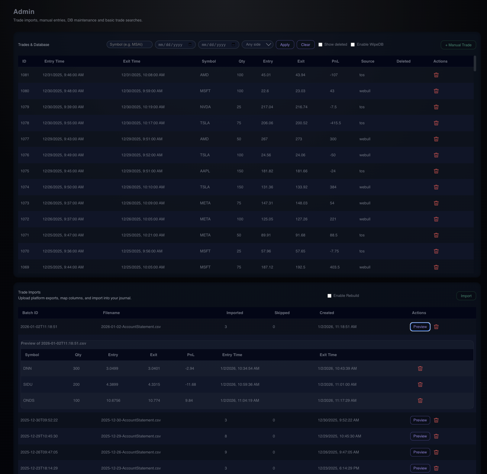
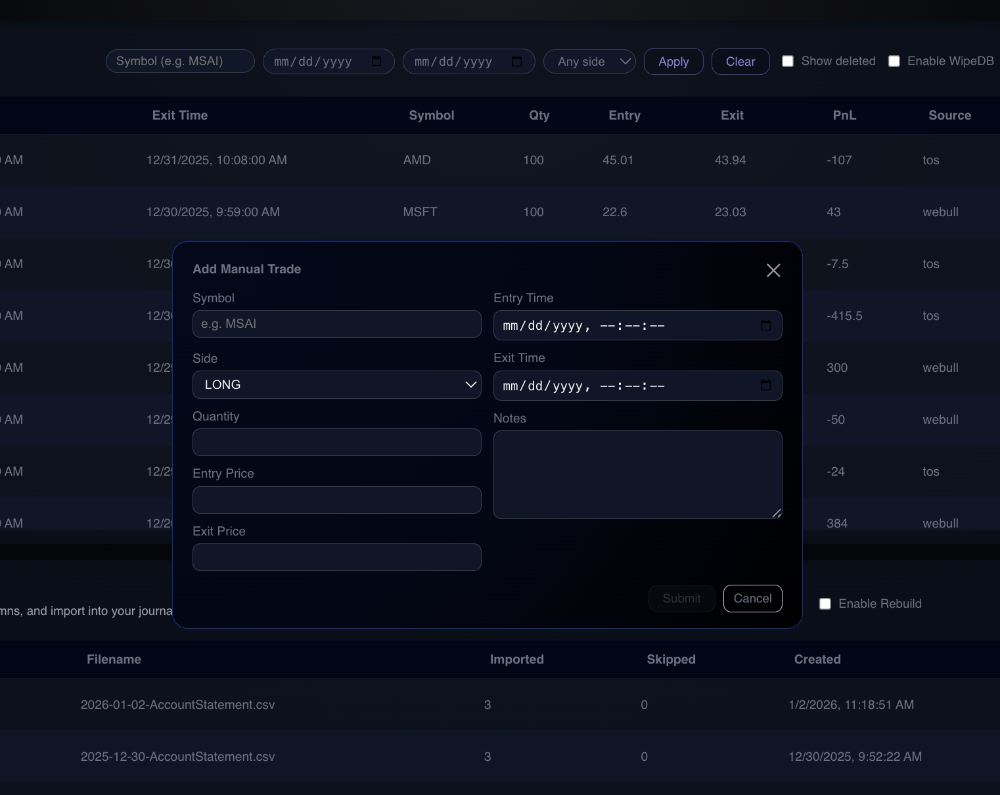

# Admin

The **Admin** page is the operational backbone of the platform.  
It is where raw broker data becomes structured trades, where the database is maintained, and where the entire system can be safely rebuilt without losing historical context.

This page is intentionally utilitarian — it is not about performance visualization, but about **data integrity, control, and repeatability**.

## Admin Overview

The Admin page is the system’s control plane for data ingestion and maintenance.

---

## Purpose

The Admin page exists to solve a core problem with most trading journals:

> *“Your data is trapped inside someone else’s system, processed in ways you don’t control.”*

This platform takes the opposite approach:
- All trade data is **local**
- All transformations are **deterministic**
- All metrics can be **recomputed at any time**

Admin is the entry point for that philosophy.

---

## Trade Import Engine

### Broker Imports
The system currently supports:
- **ThinkOrSwim (TOS)**
- **Webull**

Each import:
1. Parses broker exports
2. Pairs executions into completed trades
3. Locates stop logic (manual, auto, trailing)
4. Derives:
   - R-multiple
   - Stop violations
   - Loss beyond stop
   - Trade duration
5. Emits fully normalized trade records into the database

Once imported, **all downstream analytics** (Dashboard, Performance, Behavior) are driven entirely from this derived trade layer.

---

### Import Management
The Admin page allows:
- Viewing all past imports
- Previewing parsed trades before final ingestion
- Deleting or re-importing batches
- Tracking imported vs skipped rows
- Auditing import timestamps and sources

This makes the ingestion process transparent and reversible.

---

## Database Control & Maintenance

Admin is also the **database control plane**.

### Destructive Operations (Intentional)
The system supports:
- Full database wipe
- Schema rebuild
- Reprocessing historical trades with new logic

This is by design.

If trade pairing logic changes, or R-multiple derivation is refined, the entire dataset can be recomputed **without re-uploading original broker files**.

To support this:
- Raw imports are preserved
- Trade logic is versioned
- Automated backups are created before destructive actions

This allows experimentation without permanent data loss.

---

## Trade Search & Inspection

Admin provides direct access to raw trades:
- Filter by symbol
- Filter by date range
- Inspect individual trades
- View execution-level details

This is where database-level debugging happens — not in the dashboard.

If something looks “off” in analytics, this page is where truth is verified.

## Trade Imports

Imports trades from broker exports (TOS, Webull), pairs executions,
derives stops, and calculates R.

---

## Manual Trade Entry

While the platform is import-driven, Admin also supports **manual trade entry** for:
- One-off trades
- Unsupported brokers
- External executions
- Historical backfills

Manually entered trades are treated identically to imported trades once stored — they flow through the same analytics, grading, and behavior systems.

---

## Why This Page Matters

Admin is not a convenience feature — it is a **design statement**.

It reflects several deliberate decisions:
- Data should be **owned**, not rented
- Analytics should be **reproducible**
- Metrics should be **derived, not hard-coded**
- Mistakes should be **recoverable**

This page enables rapid iteration on trade logic, behavior analysis, and risk modeling without locking the user into a fragile or opaque system.

---

## In Short

**Admin is the trade engine.**

Everything else in the platform exists downstream of what happens here.

If the Dashboard shows *what happened*,  
and Performance shows *how well*,  
Admin is where the system decides *what actually happened* in the first place.
