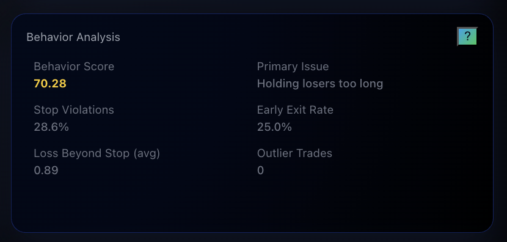
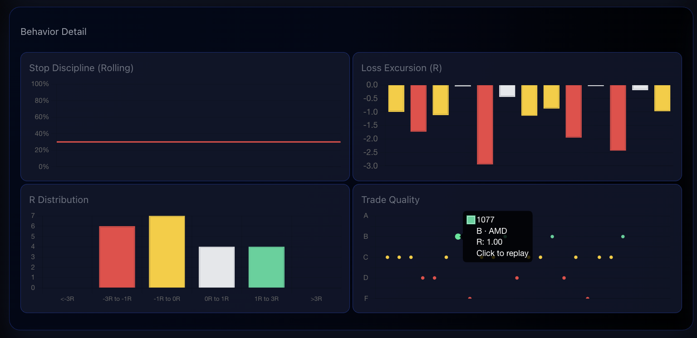
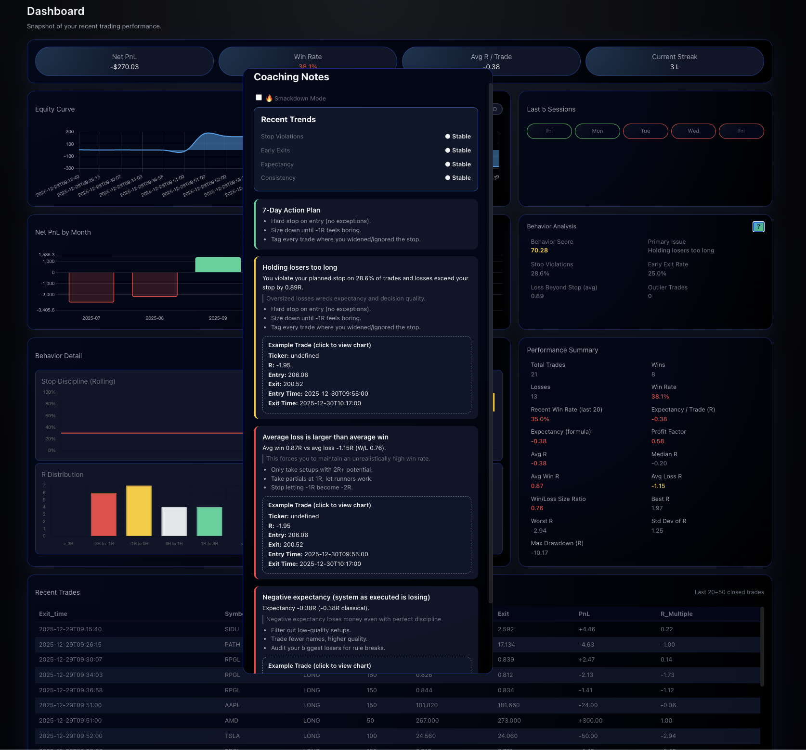

# Behavior & Coaching Engine

The **Behavior** system is the core of this project. It exists to answer one question honestly and without emotion:

> *“How well am I executing my plan, regardless of PnL?”*

This layer turns raw trade data into **direct, sometimes uncomfortable feedback**. It does not predict markets, suggest trades, or optimize entries. It evaluates **behavioral execution** based on what actually happened.

Everything here is derived from **local trade data**. No prompts. No journaling after the fact. No cloud dependency.  
My trades, my data, my accountability.

## Behavior Analysis

High-level behavioral metrics identifying the biggest execution leaks.

## Behavior Detail

Visual breakdown of stop discipline, loss excursion, and R distribution.

## Coaching Engine

Automated coaching modules generated from actual trade behavior.

---

## Philosophy

Most traders already know *what* they should do. The problem is consistency.

The Behavior engine is designed to:
- Remove hindsight bias
- Call out repeat mistakes in real time
- Translate statistics into **actionable coaching**
- Force accountability without emotion

This is not motivational content.  
It is **performance feedback**.

---

## Behavior Analysis (High-Level)

The Behavior Analysis panel provides a quick read on execution quality.

### Metrics Tracked
- **Behavior Score** – composite execution score (0–100)
- **Primary Issue** – dominant behavioral leak
- **Stop Violations** – % of trades where stops were ignored or widened
- **Early Exit Rate** – frequency of premature profit-taking
- **Loss Beyond Stop (avg R)** – how far losers exceed planned risk
- **Outlier Trades** – extreme deviations from normal behavior

This section answers:
- *Am I stable, improving, or regressing?*
- *What is currently costing me the most money?*

---

## Coaching Notes Panel

This is the heart of the system.

Based on recent trades, the engine generates **coaching modules** that surface:
- What behavior is breaking expectancy
- Why it matters
- What to do immediately

### Trend Status
Each behavior trend is labeled as:
- **Improving**
- **Stable**
- **Worsening**

Tracked trends include:
- Stop violations
- Early exits
- Expectancy
- Consistency

---

## 7-Day Fix-It Plan

When issues persist, the system generates a short-term corrective plan.

Example directives:
- Hard stop on entry (no exceptions)
- Size down until -1R feels boring
- Tag every trade where the stop was widened or ignored

This is intentionally simple and repetitive.  
The goal is **behavioral reset**, not optimization.

---

## Coaching Modules

When specific problems are detected, targeted modules appear.

### Examples

#### Holding Losers Too Long
Triggered when:
- Planned stops are violated
- Losses exceed intended R

Focus:
- Cutting invalid trades immediately
- Preventing -1R from becoming -3R disasters

Each module includes:
- Clear explanation of the issue
- Why it is damaging expectancy
- Concrete corrective actions
- A real **example trade** with replay access

---

#### Risk Management Is Upside Down
Triggered when:
- Average loss exceeds average win
- Small winners and oversized losers dominate results

Focus:
- Enforcing minimum R targets
- Letting winners work
- Eliminating hope-based holds

---

#### System Is Losing Money
Triggered when:
- Expectancy is negative over a meaningful sample
- Even perfect discipline would not be profitable

Focus:
- Pausing discretionary trading
- Removing low-quality setups
- Auditing rule breaks and assumptions

This module is blunt by design.

---

## Behavior Detail Charts

These charts provide visual reinforcement of execution patterns.

### Stop Discipline (Rolling)
Shows adherence to planned stops over time.

### Loss Excursion (R)
Visualizes how far trades move beyond planned risk.

### R Distribution
Buckets outcomes by R multiple to reveal skew:
- Too many large losers
- Too few meaningful winners

### Trade Quality
Grades each trade (A–F) based on:
- Setup quality
- Stop placement
- Execution discipline

Each point is clickable for replay.

---

## Why This Exists

This system exists because:
- I don’t trust memory
- I don’t want cloud-based analytics controlling my data
- I don’t want to explain my mistakes to an AI after the fact

The data already knows the truth.

This engine forces that truth to surface **while it still matters**, not months later in a spreadsheet review.

---

## Scope & Limitations

- Current focus: **equities**
- Options trading not yet modeled
- Coaching logic will evolve as new behavioral patterns emerge

This is a living system.

The goal is not perfection.  
The goal is **honest feedback, fast correction, and sustained execution improvement**.

## Coaching & Behavior Signals

Coaching insights surface recurring behavioral issues such as stop violations or early exits, using real trade data.