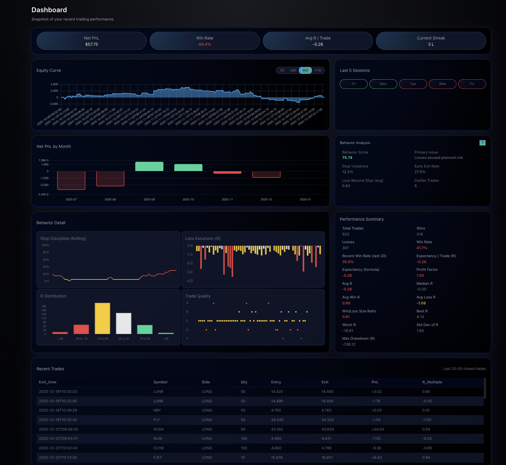
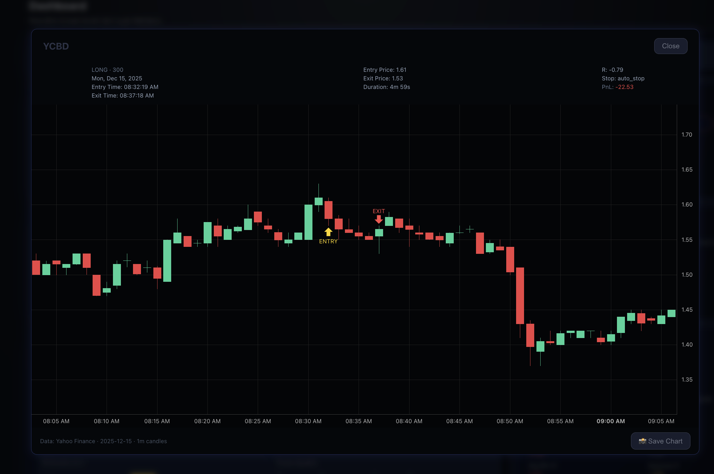

# Dashboard — Trading Behavior & Execution Review

The Dashboard is the primary **post-trade review surface**.  
I do **not** use it to chase profit or validate outcomes — I use it to evaluate **execution quality**, **decision-making**, and **behavioral stability**.

This page is reviewed *after* a trading session, never during one.

This view provides a high-level snapshot of recent performance, focusing on execution metrics rather than raw profit and loss.
---

## What the Dashboard Is For

The Dashboard answers a small set of deliberate questions:

- Am I trading **better or worse** over time?
- Are losses coming from **bad setups** or **poor execution**?
- Is my behavior **stable**, **improving**, or **degrading**?
- Where did I violate my own rules?
- Should I slow down, size down, or continue as-is?

Profit is a byproduct.  
Execution is the focus.

---

## High-Level Metrics

These summary metrics provide **context**, not validation:

- **Net PnL**
- **Win Rate**
- **Average R per Trade**
- **Current Streak**

I treat these as *signals* that something may require investigation, not as goals to optimize directly.

A flat or slightly negative period paired with improving behavior is acceptable.  
A profitable period with degrading discipline is not.

---

## Equity Curve (Rolling Window)

The equity curve is viewed using rolling windows (7D / 30D / 90D).

What I look for:

- Shape of drawdowns (sharp vs controlled)
- Recovery behavior (discipline vs overtrading)
- Compression vs expansion of returns
- Whether improvement comes from **fewer, better trades**

The equity curve is diagnostic, not emotional.

---

## Net PnL by Month

Monthly aggregation provides structural context:

- Identifies consistently weak periods
- Separates market conditions from execution issues
- Shows whether improvement is sustained or temporary

This view helps answer:  
“Is this a system problem or a behavior problem?”

---

## Behavior Analysis (Coaching Layer)

This is where the Dashboard becomes a **coaching tool**.

The system tracks and evaluates:

- Stop violations
- Early exits
- Losses exceeding planned risk
- Expectancy drift
- Consistency over time

Each behavioral issue includes:

- A short explanation of *why it matters*
- A concrete corrective action
- A linked example trade for visual review

I don’t expect perfection.  
I expect **awareness and correction**.

---

## Behavior Detail & Distributions

Supporting panels show:

- Loss excursion (R)
- Stop discipline over time
- R distribution across trades
- Trade quality dispersion

These answer questions like:

- How often do losses exceed plan?
- Are large losses rare or habitual?
- Does my R distribution justify my win rate?

This prevents rationalizing poor outcomes as “just market noise.”

---

## Trade Quality Grading

Each trade is graded (A–F) based on:

- Setup quality
- Stop placement logic
- Risk alignment
- Exit discipline

This allows me to distinguish:

- Losing **good trades**
- Winning **bad trades**
- Good setups executed poorly

That distinction matters more than raw profitability.

## Performance Summary Metrics

High-level statistics used to evaluate system health, not single trades.

---

## Recent Trades & Replay

From the Dashboard, I frequently jump directly into **trade replays**.

Replay charts show:

- Entry
- Planned stop
- Actual exit
- What price did *after* the exit

This is the most impactful feedback loop.

Seeing a trade stop out and then move in the original direction is uncomfortable — and instructive.  
It reinforces whether the mistake was **execution**, **risk placement**, or **trade selection**.

## Trade Review & Replay

Each trade can be replayed with entry and exit markers to visually audit stop placement, timing, and post-exit price action.

---

## Summary

The Dashboard is not designed to make me feel good.

It is designed to:

- Reduce repeat mistakes
- Surface behavioral drift early
- Reinforce discipline over outcomes
- Turn losing trades into actionable feedback

In practice, I care far more about **execution quality trending up** than short-term profitability.