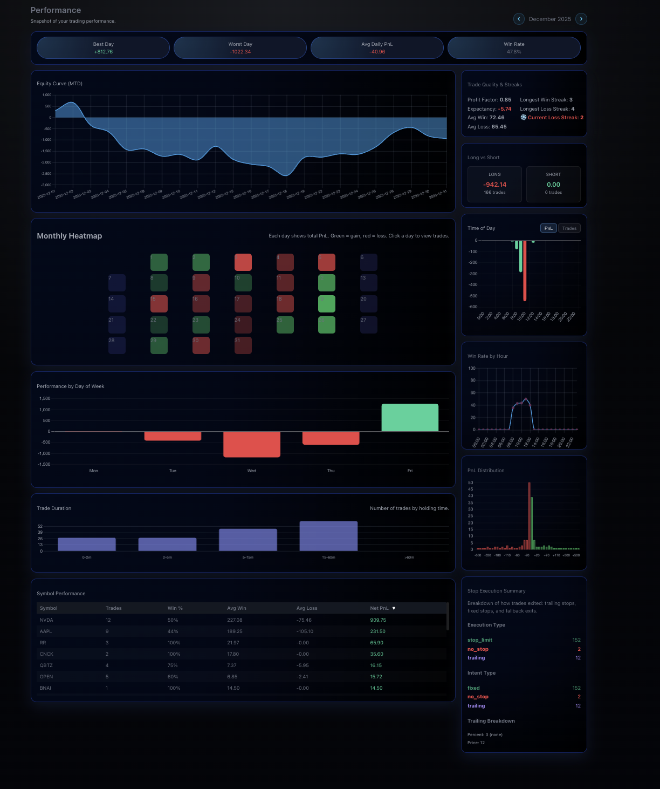
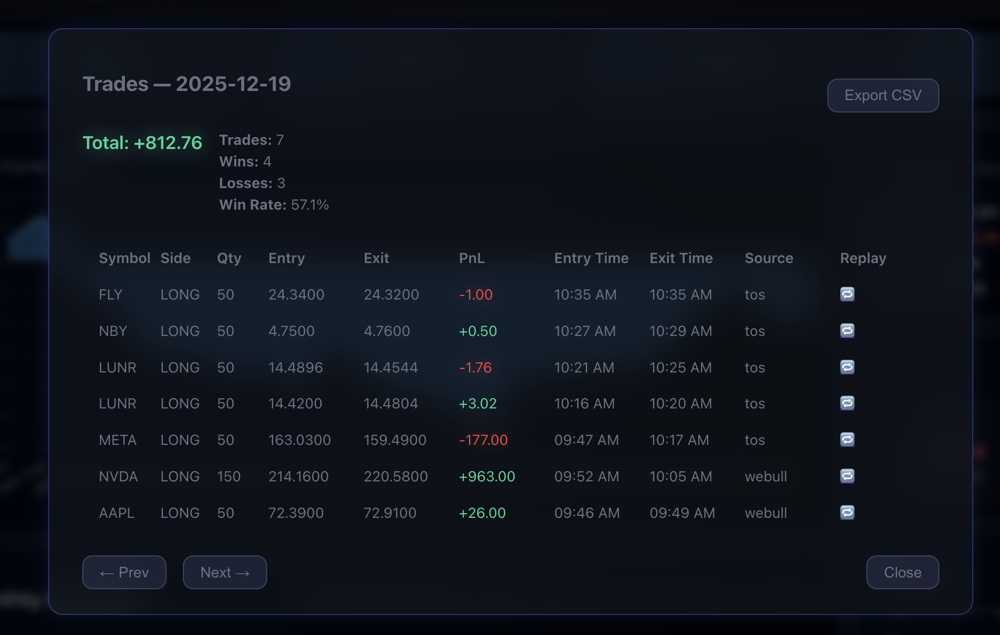
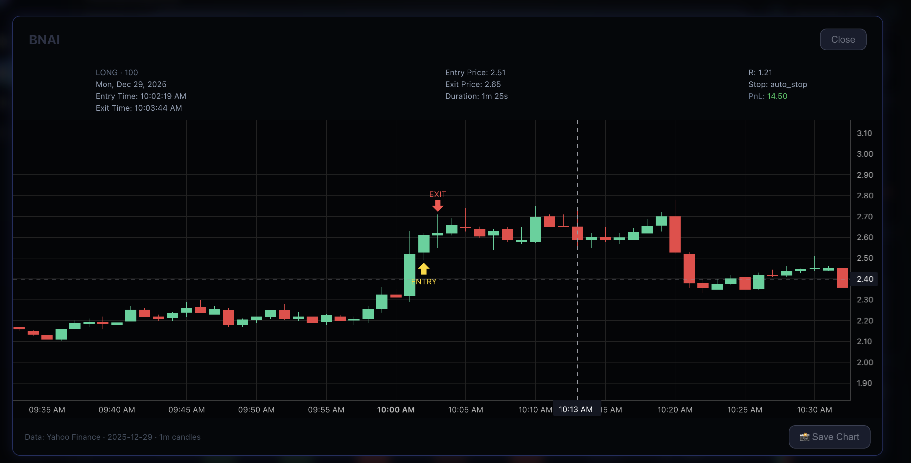

# Performance

The **Performance** page is a deeper, time-boxed review of my trading behavior and outcomes.  
While the Dashboard answers *“how am I doing right now?”*, Performance answers:

> **“Where do I consistently perform well, and where do I repeatedly get in my own way?”**

This page is less about individual trades and more about **patterns** — across symbols, time of day, stop execution, and holding behavior.

## Performance Overview

Monthly performance breakdown with equity curve and win/loss distribution.

---

## What I Use This Page For

I primarily use Performance in three situations:

1. **Pre-market or early session**
   - To sanity-check symbols I’m considering trading
   - To see whether a ticker has been a consistent winner, a nemesis, or pure noise

2. **Mid-session discipline checks**
   - Especially Symbol Performance and Time-of-Day data
   - To avoid overtrading during historically weak hours

3. **End-of-month review**
   - To identify structural issues that won’t be obvious trade-by-trade
   - To validate whether rule changes actually improved outcomes

This page helps answer:
- *Should I trade this symbol today at all?*
- *Am I forcing trades outside my best window?*
- *Is my stop execution helping or hurting expectancy?*

---

## Equity Curve (Monthly / MTD)

The equity curve here is scoped to a **monthly or rolling window**, not lifetime.

I don’t use this curve to judge success — I use it to spot:
- prolonged drawdown behavior
- recovery characteristics
- whether changes in execution flattened or steepened losses

A smooth equity curve with negative expectancy is still a problem.  
A volatile curve with improving structure may not be.

---

## Monthly Heatmap

Each day is color-coded by net PnL.

This gives me a fast visual answer to:
- *Am I trading too many days when I shouldn’t be trading at all?*
- *Are green days clustered around certain conditions or hours?*
- *Do I revenge-trade after red days?*

Clicking a day drills directly into the underlying trades.

---

## Symbol Performance

This is the **most-used section during live trading**.

For each symbol, I can see:
- total trades
- win rate
- average win vs average loss
- net PnL

I use this as a **bias filter**, not a signal:
- Some symbols are statistically fine but *mentally expensive*
- Others “feel bad” but are actually profitable over time

If a symbol has repeatedly punished poor discipline, I may skip it **even if the setup looks clean**.

Sometimes the right trade is *not trading that ticker today*.

---

## Time of Day & Win Rate by Hour

This section exists to call me out.

It answers:
- *When do I actually perform best?*
- *When do I consistently give profits back?*

If my win rate collapses after a certain hour, this data makes it impossible to ignore.

This has directly influenced:
- reducing trade frequency outside my “good window”
- avoiding late-session forcing
- stopping early when conditions deteriorate

## Time-Based Edge Discovery

Time-of-day and holding-period analysis to identify when I perform best.

## Trade Replay (Performance Context)

Replays are used here to identify *systemic* issues, not single mistakes.

---

## Stop Execution Summary

This section breaks down:
- stop types used (fixed, trailing, none)
- execution methods
- frequency of stop violations

It exists to answer one uncomfortable question:

> **Are my losses coming from bad setups, or from breaking my own rules?**

Over time, this has helped me separate:
- strategy issues  
from
- execution failures

Only one of those improves by “finding better setups.”

---

## Trade Duration & PnL Distribution

These views help identify mismatches between:
- how long I *think* I hold trades
- how long I actually do

and whether:
- small wins are subsidizing large losses
- losses cluster beyond planned R

This data directly feeds back into:
- position sizing
- stop placement
- partial-taking rules

---

## How Performance Differs from the Dashboard

| Dashboard | Performance |
|---------|-------------|
| Recent, rolling view | Time-boxed (monthly / MTD) |
| Behavior coaching | Structural analysis |
| Individual examples | Aggregated patterns |
| “What’s happening now?” | “What keeps happening?” |

Both are required. Neither works alone.

---

## Why This Exists

This page was built because **intuition lies** — especially after a rough session.

Performance forces me to confront:
- data over feelings
- patterns over anecdotes
- execution over excuses

It doesn’t tell me *what* to trade.

It tells me **when I should probably stand down — or focus harder**.